# Voice Pipeline Agent Architecture Diagram

## Pipeline Flow

```mermaid
graph LR
    User(("User 👤"))
    Room["LiveKit Room"]
    VAD["Voice Activity Detection\n(Silero)"]
    STT["Speech-to-Text\n(Deepgram)"]
    LLM["Language Model\n(OpenAI)"]
    Functions["External Functions\n(Weather API)"]
    TTS["Text-to-Speech\n(ElevenLabs)"]
    
    User -- "Speaks" --> Room
    Room -- "Audio Stream" --> VAD
    VAD -- "Speech Detected" --> STT
    STT -- "Text" --> LLM
    LLM -- "Query" --> Functions
    Functions -- "Data" --> LLM
    LLM -- "Response Text" --> TTS
    TTS -- "Audio Response" --> Room
    Room -- "Plays" --> User
    
    style User fill:#f9f,stroke:#333,stroke-width:2px
    style Room fill:#bbf,stroke:#333,stroke-width:2px
    style VAD fill:#bfb,stroke:#333,stroke-width:2px
    style STT fill:#bfb,stroke:#333,stroke-width:2px
    style LLM fill:#fbb,stroke:#333,stroke-width:2px
    style Functions fill:#fbb,stroke:#333,stroke-width:2px
    style TTS fill:#bfb,stroke:#333,stroke-width:2px
```

## Component Interaction

```mermaid
sequenceDiagram
    participant User
    participant Room as LiveKit Room
    participant Agent as Voice Pipeline Agent
    participant VAD as Silero VAD
    participant STT as Deepgram STT
    participant LLM as OpenAI LLM
    participant API as External API
    participant TTS as ElevenLabs TTS
    
    User->>Room: Joins room
    Room->>Agent: Participant joined
    Agent->>TTS: Generate welcome message
    TTS->>Room: "Hey, how can I help you today"
    Room->>User: Plays welcome message
    
    User->>Room: "What's the weather in New York?"
    Room->>VAD: Audio stream
    VAD->>VAD: Detects speech activity
    VAD->>STT: Speech audio
    STT->>LLM: "What's the weather in New York?"
    LLM->>LLM: Identifies weather function needed
    LLM->>API: Request weather for "New York"
    API->>LLM: Returns weather data
    LLM->>TTS: "The weather in New York is sunny and 75°F"
    TTS->>Room: Synthesized voice response
    Room->>User: Plays response audio
```

## Code Architecture

## Environment Setup

These diagrams provide a visual representation of how the Voice Pipeline Agent works at different levels of abstraction, from the high-level pipeline flow to the detailed sequence of operations and the code architecture.
