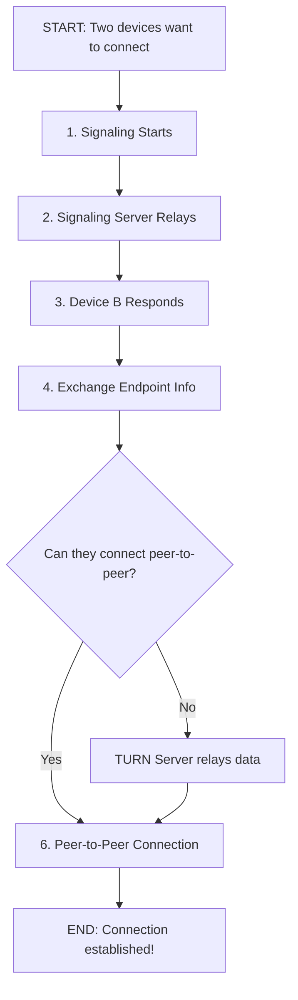

# WebRTC Connection Flowchart

Here's a flowchart explaining how WebRTC connects two devices:

### Explanation

1. **Signaling Starts**: Device A kicks things off by sending a message through a signaling server.
2. **Server Relays**: The server forwards this to Device B (but doesn't keep the message).
3. **Device B Responds**: Device B sends its own message back through the server.
4. **Endpoint Info**: Both devices figure out how to find each other (using STUN/TURN if needed).
5. **Decision**: Can they connect directly? If yes, they go peer-to-peer. If no, a TURN server helps relay.
6. **Peer-to-Peer**: Once connected, data flows directly between them—no storage on servers.

This is how WebRTC sets up a fast, direct line without storing your conversation!

## Key Components

- **Signaling Server**: Helps devices find each other initially
- **STUN Server**: Helps devices discover their public IP addresses
- **TURN Server**: Relays traffic when direct peer-to-peer connection isn't possible
- **ICE Framework**: Manages the connection process and fallback options