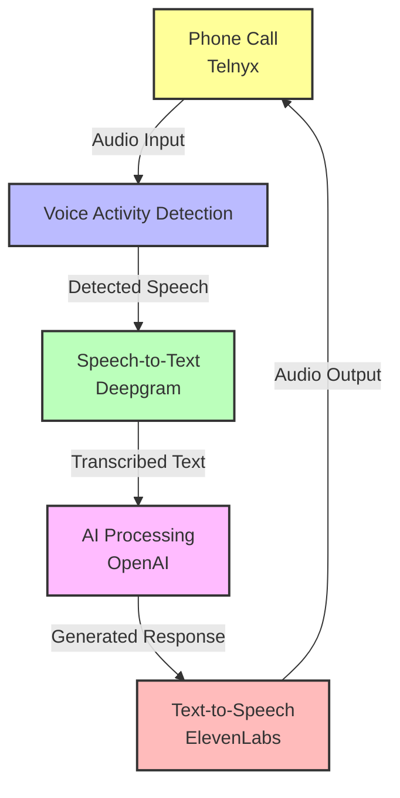
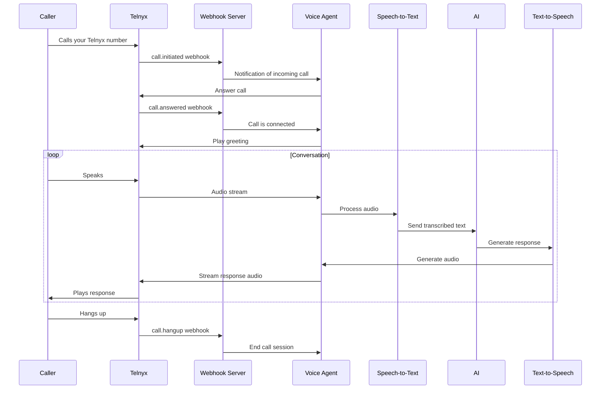

Building a Voice Pipeline Agent from Scratch: An In-Depth Guide for a Junior Intern

Hey there! I totally get where you're coming from—you want a deep, hands-on guide to help a junior intern create a voice pipeline agent from the ground up, not just use an existing one. This guide will walk you through every step of building the project from scratch, diving deep into the file structure, the main files like agent.ts, and every piece of code and configuration needed to make it work. We'll assume you're starting with an empty directory and building everything yourself, with detailed explanations so you understand why each part matters. Let's get started!

## 1. What We're Building

We're creating a voice pipeline agent using Node.js and TypeScript. This agent will:

- Make and receive phone calls using Telnyx
- Detect when someone speaks (Voice Activity Detection, or VAD).
- Transcribe speech to text (using Deepgram).
- Generate a response with an AI model (using OpenAI).
- Convert that response back to speech (using ElevenLabs).
- Play the audio response to the user.

We'll use the LiveKit Agents Framework to tie everything together. This guide is based on the concepts in the voice-pipeline-agent-node repository, but we're building it from scratch—no cloning allowed!

### Voice Pipeline Architecture



## 3. Designing the File Structure

Let's create the project's file structure manually. Here's what it'll look like:

```
voice-pipeline-agent-node/
├── src/                    # Source code
│   ├── agent.ts            # Main agent logic
│   ├── config.ts           # Configuration settings
│   ├── telnyx.ts           # Telnyx call handling
│   └── utils/              # Utility functions
│       └── logger.ts       # Logging functionality
├── dist/                   # Compiled JavaScript (generated)
├── package.json            # Project metadata and dependencies
├── pnpm-lock.yaml          # Dependency lock file (generated)
├── .env                    # Environment variables (API keys)
├── .gitignore              # Git ignore file
├── tsconfig.json           # TypeScript config
└── .eslintrc.js            # ESLint configuration
```

Run these commands to create the directory structure:
```bash
mkdir -p src/utils dist
touch src/agent.ts src/config.ts src/telnyx.ts src/utils/logger.ts
touch .env .gitignore
```

## 4. Building the Configuration System

First, let's set up a robust configuration system to manage environment variables.

Create src/config.ts:
```typescript
// src/config.ts
import * as dotenv from 'dotenv';
import * as path from 'path';

// Load environment variables from .env file
dotenv.config({ path: path.resolve(process.cwd(), '.env') });

// Define the configuration interface
interface Config {
  // Required configuration
  openai: {
    apiKey: string;
    model: string;
    systemPrompt: string;
  };
  deepgram: {
    apiKey: string;
  };
  elevenlabs: {
    apiKey: string;
    voice: string;
  };
  telnyx: {
    apiKey: string;
    appId?: string;
    outboundVoiceProfileId?: string;
  };
  // Optional configuration
  livekit?: {
    url?: string;
    apiKey?: string;
    apiSecret?: string;
  };
}

// Validate required environment variables
const requiredEnvVars = [
  'OPENAI_API_KEY',
  'DEEPGRAM_API_KEY',
  'ELEVENLABS_API_KEY',
  'TELNYX_API_KEY'
];

const missingVars = requiredEnvVars.filter(envVar => !process.env[envVar]);
if (missingVars.length > 0) {
  throw new Error(`Missing required environment variables: ${missingVars.join(', ')}`);
}

// Create and export the configuration
const config: Config = {
  openai: {
    apiKey: process.env.OPENAI_API_KEY!,
    model: process.env.OPENAI_MODEL || 'gpt-3.5-turbo',
    systemPrompt: process.env.OPENAI_SYSTEM_PROMPT || 'You are a friendly assistant who helps users with their questions.',
  },
  deepgram: {
    apiKey: process.env.DEEPGRAM_API_KEY!,
  },
  elevenlabs: {
    apiKey: process.env.ELEVENLABS_API_KEY!,
    voice: process.env.ELEVENLABS_VOICE || 'Rachel',
  },
  telnyx: {
    apiKey: process.env.TELNYX_API_KEY!,
    appId: process.env.TELNYX_APP_ID,
    outboundVoiceProfileId: process.env.TELNYX_OUTBOUND_VOICE_PROFILE_ID,
  },
  livekit: {
    url: process.env.LIVEKIT_URL,
    apiKey: process.env.LIVEKIT_API_KEY,
    apiSecret: process.env.LIVEKIT_API_SECRET,
  }
};

export default config;
```

## 7. Environment Setup

Create a .env file in the root directory to securely store your API keys:
```
DEEPGRAM_API_KEY=your-deepgram-key-here
OPENAI_API_KEY=your-openai-key-here
ELEVENLABS_API_KEY=your-elevenlabs-key-here
TELNYX_API_KEY=your-telnyx-key-here
TELNYX_APP_ID=your-telnyx-app-id-here
TELNYX_OUTBOUND_VOICE_PROFILE_ID=your-telnyx-voice-profile-id
OPENAI_MODEL=gpt-3.5-turbo
ELEVENLABS_VOICE=Rachel
LIVEKIT_URL=your-livekit-url-here
LIVEKIT_API_KEY=your-livekit-api-key-here
LIVEKIT_API_SECRET=your-livekit-api-secret-here
```

## 8. Getting API Keys

The agent won't work without API keys. Here's how to get them:

### 8.4. Telnyx (Phone Calls)

1. Sign up at [telnyx.com](https://telnyx.com).
2. Create an API key from the Telnyx Mission Control Portal.
3. Add it to .env as `TELNYX_API_KEY`.
4. Set up a Telnyx Application for call handling (see detailed section below).

## Telnyx Integration

### What Is Telnyx?

Telnyx is a communications platform that provides voice, messaging, and other communication services. In our voice pipeline agent, we'll use Telnyx to:

1. Handle incoming phone calls
2. Place outbound calls
3. Bridge the call audio with our agent's voice processing pipeline

This allows our voice agent to interact with callers over the standard telephone network, making it accessible without requiring specialized apps or equipment.

### Setting Up Telnyx for Your Voice Agent

#### 1. Create a Telnyx Account and Get API Key

1. Sign up at [telnyx.com](https://telnyx.com).
2. Navigate to the Mission Control Portal.
3. Under Auth > API Keys, create a new API V2 key.
4. Copy this key to your .env file as `TELNYX_API_KEY`.

#### 2. Set Up a Telnyx Application

1. In the Telnyx Portal, go to "Voice" > "Applications".
2. Create a new application with the following settings:
   - **Name**: Voice Pipeline Agent
   - **Webhook URL**: The public endpoint where your agent will handle webhook events (more on this below)
   - **Webhook Event Types**: Select all call-related events
   - **Security**: Enable HMAC validation for added security

3. Save the Application ID to your .env file as `TELNYX_APP_ID`.

#### 3. Purchase and Configure a Phone Number

1. Go to "Numbers" > "Buy Numbers".
2. Purchase a phone number with voice capabilities.
3. Assign this number to your Telnyx Application.

#### 4. Create an Outbound Voice Profile

1. Go to "Voice" > "Outbound Voice Profiles".
2. Create a new profile.
3. Save the profile ID to your .env file as `TELNYX_OUTBOUND_VOICE_PROFILE_ID`.

### Implementing Telnyx Call Handling

Create a new file `src/telnyx.ts` that will handle all Telnyx-related functionality:

```typescript
// src/telnyx.ts
import telnyx from 'telnyx';
import config from './config';
import logger from './utils/logger';
import { runAgentWorker } from '@livekit/agents';
import { DeepgramSTT } from '@livekit/agents-plugin-deepgram';
import { OpenAIAssistant } from '@livekit/agents-plugin-openai';
import { ElevenLabsTTS } from '@livekit/agents-plugin-elevenlabs';

// Initialize Telnyx client
const telnyxClient = telnyx(config.telnyx.apiKey);

/**
 * Set up a WebSocket connection for real-time call control
 */
let socket: any = null;
function setupTelnyxSocket(): void {
  try {
    // Initialize WebSocket connection
    socket = new telnyx.WebhookSocket();
    
    // Connection established
    socket.on('connected', () => {
      logger.info('Connected to Telnyx WebSocket');
    });
    
    // Handle errors
    socket.on('error', (error: any) => {
      logger.error('Telnyx WebSocket error:', error);
      // Attempt to reconnect
      setTimeout(() => {
        logger.info('Attempting to reconnect to Telnyx WebSocket...');
        setupTelnyxSocket();
      }, 5000);
    });
    
    // Handle disconnections
    socket.on('disconnected', () => {
      logger.warn('Disconnected from Telnyx WebSocket');
      // Attempt to reconnect
      setTimeout(() => {
        logger.info('Attempting to reconnect to Telnyx WebSocket...');
        setupTelnyxSocket();
      }, 5000);
    });
    
    // Handle incoming webhook events
    socket.on('message', (webhookEvent: any) => {
      handleTelnyxWebhook(webhookEvent);
    });
    
  } catch (error) {
    logger.error('Failed to set up Telnyx WebSocket:', error);
    // Attempt to reconnect
    setTimeout(() => {
      logger.info('Attempting to reconnect to Telnyx WebSocket...');
      setupTelnyxSocket();
    }, 5000);
  }
}

/**
 * Handle incoming Telnyx webhook events
 */
async function handleTelnyxWebhook(webhookEvent: any): Promise<void> {
  try {
    const { data } = webhookEvent;
    const eventType = data.event_type;
    
    logger.debug(`Received Telnyx event: ${eventType}`);
    
    // Handle different event types
    switch (eventType) {
      case 'call.initiated':
        // Incoming call received
        await handleIncomingCall(data);
        break;
      
      case 'call.answered':
        // Call was answered
        await handleCallAnswered(data);
        break;
      
      case 'call.hangup':
        // Call ended
        await handleCallHangup(data);
        break;
      
      case 'call.recording.saved':
        // Call recording is available
        await handleCallRecording(data);
        break;
      
      default:
        logger.debug(`Unhandled event type: ${eventType}`);
    }
  } catch (error) {
    logger.error('Error handling Telnyx webhook:', error);
  }
}

/**
 * Handle an incoming call
 */
async function handleIncomingCall(data: any): Promise<void> {
  try {
    const call = await telnyxClient.calls.retrieve(data.payload.call_control_id);
    
    logger.info(`Incoming call from ${call.from}, call_control_id: ${data.payload.call_control_id}`);
    
    // Answer the call
    await telnyxClient.calls.answer({
      call_control_id: data.payload.call_control_id
    });
    
    // Store call information for later use
    // In a production system, you'd use a database
    activeCalls.set(data.payload.call_control_id, {
      callControlId: data.payload.call_control_id,
      from: call.from,
      to: call.to,
      status: 'answering'
    });
    
  } catch (error) {
    logger.error('Failed to handle incoming call:', error);
  }
}

/**
 * Handle a call that was answered
 */
async function handleCallAnswered(data: any): Promise<void> {
  try {
    const callControlId = data.payload.call_control_id;
    const activeCall = activeCalls.get(callControlId);
    
    if (activeCall) {
      logger.info(`Call answered: ${callControlId}`);
      
      // Update call status
      activeCall.status = 'connected';
      activeCalls.set(callControlId, activeCall);
      
      // Start the voice agent for this call
      await startAgentForCall(callControlId);
      
      // Play a greeting
      await telnyxClient.calls.speak({
        call_control_id: callControlId,
        payload: "Hello! I'm your AI assistant. How can I help you today?",
        voice: "female"
      });
    }
  } catch (error) {
    logger.error('Failed to handle call answered:', error);
  }
}

/**
 * Start the voice agent for a specific call
 */
async function startAgentForCall(callControlId: string): Promise<void> {
  try {
    // Create speech-to-text plugin
    const speechToText = new DeepgramSTT({
      apiKey: config.deepgram.apiKey,
    });
    
    // Create AI assistant plugin
    const aiAssistant = new OpenAIAssistant({
      apiKey: config.openai.apiKey,
      model: config.openai.model,
      systemPrompt: config.openai.systemPrompt,
    });
    
    // Create text-to-speech plugin
    const textToSpeech = new ElevenLabsTTS({
      apiKey: config.elevenlabs.apiKey,
      voice: config.elevenlabs.voice,
    });
    
    // Start the agent worker for this call
    await runAgentWorker({
      plugins: [
        speechToText,
        aiAssistant,
        textToSpeech,
      ],
      // Configure for Telnyx audio streaming
      telnyxCall: {
        callControlId,
        apiKey: config.telnyx.apiKey
      },
      onError: (error) => {
        logger.error(`Agent error for call ${callControlId}:`, error);
      },
    });
    
    logger.info(`Started agent for call ${callControlId}`);
  } catch (error) {
    logger.error(`Failed to start agent for call ${callControlId}:`, error);
  }
}

/**
 * Handle call hangup
 */
async function handleCallHangup(data: any): Promise<void> {
  try {
    const callControlId = data.payload.call_control_id;
    
    logger.info(`Call ended: ${callControlId}`);
    
    // Clean up resources
    activeCalls.delete(callControlId);
    
  } catch (error) {
    logger.error('Failed to handle call hangup:', error);
  }
}

/**
 * Handle saved call recording
 */
async function handleCallRecording(data: any): Promise<void> {
  try {
    const recordingUrl = data.payload.recording_urls.mp3;
    
    logger.info(`Call recording available: ${recordingUrl}`);
    
    // Process or store recording as needed
    
  } catch (error) {
    logger.error('Failed to handle call recording:', error);
  }
}

/**
 * Make an outbound call
 */
export async function makeOutboundCall(to: string): Promise<string | null> {
  try {
    logger.info(`Making outbound call to ${to}`);
    
    // Create the call
    const call = await telnyxClient.calls.create({
      connection_id: config.telnyx.outboundVoiceProfileId,
      to,
      from: '+1XXXXXXXXXX', // Replace with your Telnyx number
      audio_url: 'https://example.com/greeting.mp3', // Initial greeting
      webhook_url: 'https://your-webhook-url.com/telnyx/webhooks'
    });
    
    return call.call_control_id;
  } catch (error) {
    logger.error('Failed to make outbound call:', error);
    return null;
  }
}

// Map to track active calls
const activeCalls = new Map();

// Export functions
export {
  setupTelnyxSocket,
  handleTelnyxWebhook
};
```

### Integrating Telnyx with the Main Agent

Now, modify your `src/agent.ts` file to include Telnyx integration:

```typescript
// src/agent.ts
import { runAgentWorker } from '@livekit/agents';
import { DeepgramSTT } from '@livekit/agents-plugin-deepgram';
import { OpenAIAssistant } from '@livekit/agents-plugin-openai';
import { ElevenLabsTTS } from '@livekit/agents-plugin-elevenlabs';
import config from './config';
import logger from './utils/logger';
import { setupTelnyxSocket, makeOutboundCall } from './telnyx';

/**
 * Initializes and runs the voice pipeline agent
 * @returns {Promise<void>} A promise that resolves when the agent is shut down
 */
async function initializeAgent(): Promise<void> {
  try {
    logger.info('Initializing voice pipeline agent...');
    
    // Setup Telnyx WebSocket for real-time call control
    setupTelnyxSocket();
    
    // The agent for each call will be instantiated when calls come in
    // See telnyx.ts for call handling logic
    
    logger.info('Voice pipeline agent initialized and ready for calls');
    
    // Setup graceful shutdown
    setupGracefulShutdown();
    
  } catch (error) {
    logger.error('Failed to initialize agent:', error);
    process.exit(1);
  }
}

/**
 * Sets up handlers for graceful shutdown
 */
function setupGracefulShutdown(): void {
  // Handle process termination signals
  process.on('SIGINT', () => {
    logger.info('Received SIGINT. Shutting down gracefully...');
    process.exit(0);
  });
  
  process.on('SIGTERM', () => {
    logger.info('Received SIGTERM. Shutting down gracefully...');
    process.exit(0);
  });
  
  // Handle uncaught exceptions
  process.on('uncaughtException', (error) => {
    logger.error('Uncaught exception:', error);
    process.exit(1);
  });
  
  // Handle unhandled promise rejections
  process.on('unhandledRejection', (reason, promise) => {
    logger.error('Unhandled promise rejection:', reason);
    process.exit(1);
  });
}

// Start the agent when this file is run directly
if (require.main === module) {
  initializeAgent().catch((error) => {
    logger.error('Top-level error in agent initialization:', error);
    process.exit(1);
  });
}

// Export for potential programmatic use
export { initializeAgent, makeOutboundCall };
```

### Setting Up a Webhook Endpoint for Telnyx

Telnyx sends webhooks to your application to notify it about call events. You need to set up an endpoint to receive these webhooks. Here's a simple implementation using Express:

1. Install Express:
```bash
pnpm add express body-parser
```

2. Create a file `src/webhook-server.ts`:
```typescript
// src/webhook-server.ts
import express from 'express';
import bodyParser from 'body-parser';
import { handleTelnyxWebhook } from './telnyx';
import config from './config';
import logger from './utils/logger';

// Create Express app
const app = express();

// Configure middleware
app.use(bodyParser.json());

// Telnyx webhook endpoint
app.post('/webhooks/telnyx', (req, res) => {
  // Validate Telnyx webhook signature
  // In production, you should verify this signature
  
  // Process the webhook
  handleTelnyxWebhook(req.body);
  
  // Acknowledge receipt
  res.status(200).send('Webhook received');
});

// Start the server
const PORT = process.env.PORT || 3000;
app.listen(PORT, () => {
  logger.info(`Webhook server listening on port ${PORT}`);
});
```

3. Update your `package.json` to start both the agent and webhook server:
```json
{
  "scripts": {
    "build": "tsc",
    "start": "node dist/agent.js dev",
    "webhook": "node dist/webhook-server.js",
    "dev": "concurrently \"ts-node src/agent.ts dev\" \"ts-node src/webhook-server.ts\""
  }
}
```

4. Install concurrently:
```bash
pnpm add -D concurrently
```

### Making the Webhook Endpoint Publicly Accessible

For Telnyx to reach your webhook endpoint, it needs to be publicly accessible. There are several ways to accomplish this:

1. **Deploy to a cloud provider** like AWS, Google Cloud, or Heroku.
2. **Use a tunneling service** like ngrok during development:
   ```bash
   npx ngrok http 3000
   ```
   This will give you a public URL that forwards to your local server.

### Testing Your Telnyx Integration

1. Start your webhook server and agent:
   ```bash
   pnpm dev
   ```

2. Use ngrok or a similar service to expose your webhook endpoint.

3. Update your Telnyx Application webhook URL with the ngrok URL.

4. Call your Telnyx phone number to test the incoming call flow.

5. Test outbound calls with a simple script:
   ```typescript
   // test-outbound-call.ts
   import { makeOutboundCall } from './src/telnyx';
   
   async function test() {
     const callId = await makeOutboundCall('+1XXXXXXXXXX'); // Replace with a real number
     console.log(`Call initiated with ID: ${callId}`);
   }
   
   test().catch(console.error);
   ```

### Telnyx Call Flow Diagram



### Additional Telnyx Features to Explore

1. **Call Recording**: Automatically record calls for quality and training purposes.
2. **DTMF Detection**: Detect and respond to keypad inputs (e.g., "Press 1 for...").
3. **Call Transferring**: Transfer calls to other numbers or agents.
4. **Conference Calls**: Set up multi-party calls with your AI agent.
5. **Call Analytics**: Track call metrics for performance optimization.

## 10. Understanding the Complete Pipeline with Telnyx

The LiveKit Agents Framework handles the voice pipeline automatically, but understanding how it works is important:

### 10.1. Voice Pipeline Data Flow

```mermaid
flowchart LR
    subgraph Input
        Audio[User Audio]
    end
    
    subgraph VAD[Voice Activity Detection]
        Detect[Detect Speech]
    end
    
    subgraph STT[Speech to Text]
        Stream[Stream Audio]
        Process[Process Audio]
        Transcribe[Generate Transcript]
    end
    
    subgraph AI[OpenAI Processing]
        Interpret[Interpret Request]
        Generate[Generate Response]
    end
    
    subgraph TTS[Text to Speech]
        Synthesize[Synthesize Audio]
    end
    
    subgraph Output
        Response[Audio Response]
    end
    
    Audio --> VAD
    VAD --> STT
    Stream --> Process --> Transcribe
    Transcribe --> Interpret
    Interpret --> Generate
    Generate --> Synthesize
    Synthesize --> Response
    
    style Audio fill:#f9f,stroke:#333,stroke-width:2px
    style VAD fill:#bbf,stroke:#333,stroke-width:2px
    style STT fill:#bfb,stroke:#333,stroke-width:2px
    style AI fill:#fbf,stroke:#333,stroke-width:2px
    style TTS fill:#fbb,stroke:#333,stroke-width:2px
    style Response fill:#f9f,stroke:#333,stroke-width:2px
```



### 10.2. How the Pipeline Works Together

1. **Voice Activity Detection (VAD)**:
   - Built into the LiveKit framework
   - Detects when a user is speaking vs. silent
   - Triggers the pipeline when speech is detected

2. **Speech-to-Text (STT)**:
   - Receives audio chunks from VAD
   - Uses Deepgram's streaming API to transcribe in real-time
   - Produces text output once speech segment is complete

3. **AI Processing**:
   - Takes the transcribed text
   - Sends it to OpenAI's API for processing
   - Receives a text response based on the system prompt

4. **Text-to-Speech (TTS)**:
   - Takes the AI-generated text
   - Sends it to ElevenLabs for speech synthesis
   - Receives an audio stream of the spoken response

5. **Audio Output**:
   - The synthesized speech is sent back to the user
   - LiveKit handles the audio streaming

## 11. Extending the Project

Now that you have a working voice agent, here are some ways to extend it:

### 11.1. Custom Prompts and Personalities

Modify the system prompt in `config.ts` to create different AI personalities:

```typescript
// For a friendly assistant
systemPrompt: 'You are a friendly assistant who helps users with their questions.'

// For a professional assistant
systemPrompt: 'You are a professional assistant who provides concise, accurate information.'

// For a humorous assistant
systemPrompt: 'You are a witty assistant with a great sense of humor. Make your responses entertaining while remaining helpful.'
```

### 11.2. Voice Customization

Explore ElevenLabs' voice library and update the voice ID in your config:

```typescript
// In .env
ELEVENLABS_VOICE=Antonio  // Different voice ID

// Or in config.ts
elevenlabs: {
  apiKey: process.env.ELEVENLABS_API_KEY!,
  voice: 'Adam',  // Different voice ID
}
```

### 11.3. Adding Custom Plugins

The LiveKit Agents framework supports custom plugins. You could add:

- Translation services
- Sentiment analysis
- Custom pre/post-processing logic

Example of a basic custom plugin:

```typescript
// src/plugins/customPlugin.ts
import { Plugin, PluginEvent, PluginInput, PluginOutput } from '@livekit/agents';

class CustomPlugin implements Plugin {
  name = 'custom-plugin';
  
  async handleEvent(event: PluginEvent, input?: PluginInput): Promise<PluginOutput | undefined> {
    // Custom logic goes here
    return undefined;
  }
}

export { CustomPlugin };
```

## 12. Troubleshooting

### 12.1. Common Issues and Solutions

| Problem | Possible Cause | Solution |
|---------|----------------|----------|
| "API Key Undefined" | Missing or incorrectly loaded .env file | Verify .env file exists and is properly formatted |
| Build fails | TypeScript errors | Run `tsc --noEmit` to see detailed errors |
| No audio input/output | Microphone/speaker issues | Check system audio settings |
| Agent crashes | Unhandled exceptions | Check logs for error messages |
| Transcription issues | Poor audio quality | Improve microphone setup or adjust Deepgram settings |

### 12.2. Debug Checklist

1. **Environment Variables**:
   ```bash
   # Print environment variables (redacted for security)
   node -e "console.log('DEEPGRAM_API_KEY:', process.env.DEEPGRAM_API_KEY ? '✓ Set' : '✗ Missing')"
   node -e "console.log('OPENAI_API_KEY:', process.env.OPENAI_API_KEY ? '✓ Set' : '✗ Missing')"
   node -e "console.log('ELEVENLABS_API_KEY:', process.env.ELEVENLABS_API_KEY ? '✓ Set' : '✗ Missing')"
   ```

2. **API Connection Test**:
   ```bash
   # Test OpenAI connection
   curl -s -o /dev/null -w "%{http_code}" https://api.openai.com/v1/models -H "Authorization: Bearer $OPENAI_API_KEY"
   ```

3. **TypeScript Validation**:
   ```bash
   npx tsc --noEmit
   ```

4. **Increase Logging**:
   - Set the logger level to DEBUG in your code
   ```typescript
   logger.setLevel(LogLevel.DEBUG);
   ```

## 13. Deployment Considerations

While this guide focuses on local development, here are some considerations for deploying your voice agent:

### 13.1. Docker Containerization

Create a `Dockerfile`:
```dockerfile
FROM node:18-alpine

WORKDIR /app

COPY package.json pnpm-lock.yaml ./
RUN npm install -g pnpm && pnpm install --frozen-lockfile

COPY . .
RUN pnpm build

CMD ["node", "dist/agent.js"]
```

### 13.2. Environment Variables in Production

Use environment variables directly in production instead of a .env file:

```bash
# Example Docker run command
docker run -e DEEPGRAM_API_KEY=your-key -e OPENAI_API_KEY=your-key -e ELEVENLABS_API_KEY=your-key your-voice-agent
```

### 13.3. Health Monitoring

Add health check endpoints if deploying as a service.

## 14. Final File Structure

Here's the complete file structure you should have:

```
voice-pipeline-agent-node/
├── src/
│   ├── agent.ts            # Main agent logic
│   ├── config.ts           # Configuration and env variable handling
│   ├── telnyx.ts           # Telnyx call handling
│   └── utils/
│       └── logger.ts       # Logging utility
├── dist/                   # Compiled JavaScript (generated)
├── .env                    # Environment variables (API keys)
├── package.json            # Project metadata and dependencies
├── pnpm-lock.yaml          # Dependency lock file (generated)
├── tsconfig.json           # TypeScript config
├── .eslintrc.js            # ESLint configuration
└── .gitignore              # Git ignore file
```

## 15. Conclusion

Congratulations! You've built a complete voice pipeline agent from scratch. This project incorporates:

- TypeScript for type safety and better developer experience
- Proper error handling and logging
- Configuration management with environment variables
- A modular architecture that's easy to extend
- Integration with state-of-the-art AI services

Now you understand not just how to use the LiveKit Agents framework, but how every piece fits together. This knowledge will help you customize, extend, and troubleshoot your voice agent as needed.

Feel free to experiment with different voices, prompts, and even adding your own custom plugins to create unique voice experiences!