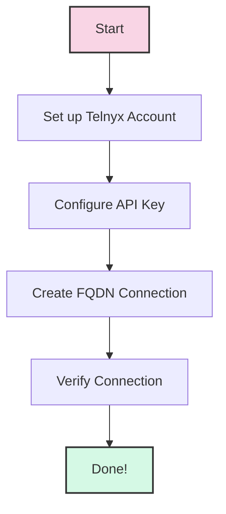
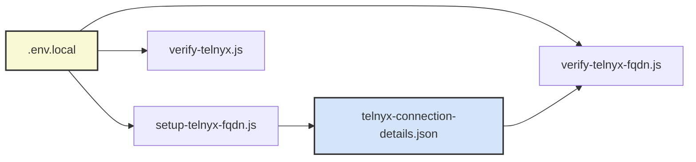
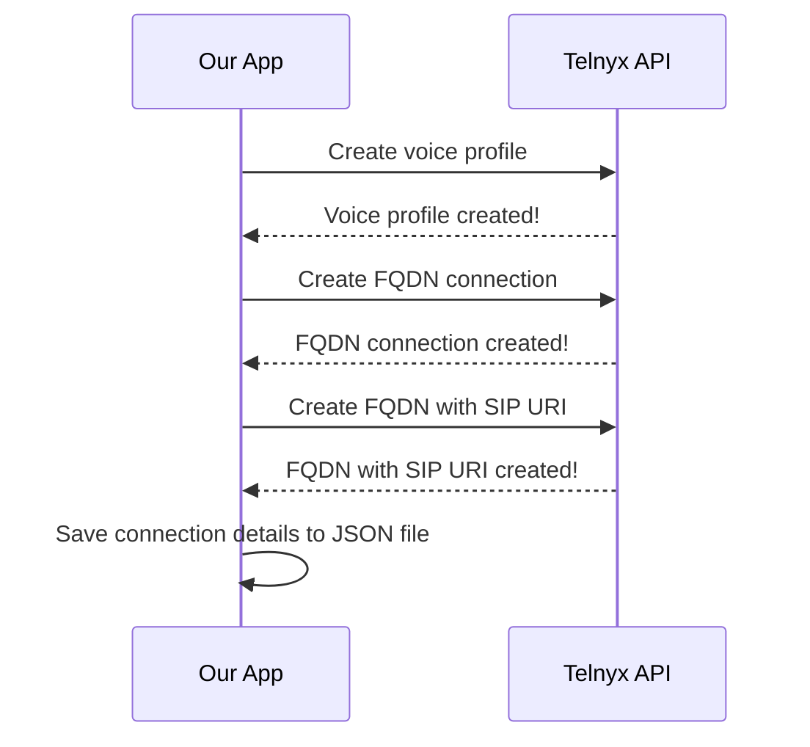
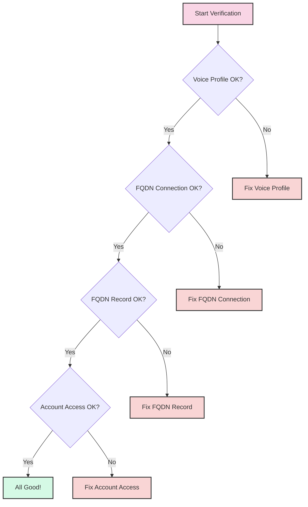
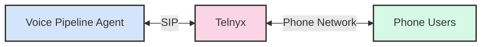

# Telnyx Integration Guide: Setting Up FQDN Connection

## Introduction

This guide will walk you through the process of integrating Telnyx with our voice pipeline agent and setting up an FQDN (Fully Qualified Domain Name) connection. This connection allows our application to make and receive phone calls through Telnyx's network.



## What is Telnyx?

Telnyx is a communications platform that allows our application to make and receive phone calls. Think of it as a bridge between our application and the traditional phone network.

## What is an FQDN Connection?

An FQDN connection is like a special tunnel that connects our application to Telnyx's network. It uses a domain name (like `example.sip.livekit.cloud`) to establish this connection.

## Prerequisites

Before starting, make sure you have:

1. A Telnyx account
2. Your Telnyx API key saved in the `.env.local` file
3. Node.js installed on your computer

## Step 1: Understanding the Project Structure

Our project uses several files to manage the Telnyx integration:

- `setup-telnyx-fqdn.js`: Creates the FQDN connection
- `verify-telnyx-fqdn.js`: Checks if the connection is working
- `verify-telnyx.js`: Verifies basic Telnyx API access
- `.env.local`: Stores your Telnyx API key



## Step 2: Verifying Your Telnyx API Key

Before setting up the connection, let's make sure your Telnyx API key is working:

1. Open your terminal
2. Navigate to the project directory
3. Run the verification script:

```bash
node verify-telnyx.js
```

You should see a success message confirming that your API key is valid.

```text
✅ TELNYX_API_KEY found in environment variables
✅ Successfully connected to Telnyx API!
```

## Step 3: Setting Up the FQDN Connection

Now that we've confirmed your API key is working, let's set up the FQDN connection:

1. In your terminal, run:

   ```bash
   node setup-telnyx-fqdn.js
   ```

2. The script will:
   - Create an outbound voice profile
   - Set up an FQDN connection
   - Link your SIP URI to the connection
   - Save all the details to a file called `telnyx-connection-details.json`



When the script completes, you'll see a success message with important information:

```text
🎉 Telnyx FQDN connection setup completed successfully!

Important information:
Voice Profile ID: 2657842349241010113
Connection ID: 2657842353275930562
FQDN ID: 2657842357075969988
SIP URI: 1ox3mp4c9qd.sip.livekit.cloud
SIP Authentication Username: automeshan
SIP Authentication Password: T3lnyx@S3cur3P@ss!
```

## Step 4: Verifying the FQDN Connection

After setting up the connection, let's make sure everything is working correctly:

1. In your terminal, run:

   ```bash
   node verify-telnyx-fqdn.js
   ```

2. The script will check:
   - If the voice profile exists
   - If the FQDN connection is active
   - If the FQDN record is properly configured
   - If your account has access to phone numbers



If everything is working, you'll see a success message:

```text
🎉 Telnyx FQDN connection verification completed successfully!
All components are properly set up and accessible.
```

## Step 5: Understanding the Connection Details

The `telnyx-connection-details.json` file contains all the information needed to use the Telnyx connection:

```json
{
  "voiceProfileId": "2657842349241010113",
  "connectionId": "2657842353275930562",
  "fqdnId": "2657842357075969988",
  "sipUri": "1ox3mp4c9qd.sip.livekit.cloud",
  "sipUsername": "automeshan",
  "sipPassword": "T3lnyx@S3cur3P@ss!"
}
```

These details are used by our voice pipeline agent to connect to Telnyx.

## Step 6: Checking the Telnyx Portal

You can also check your connection in the Telnyx portal:

1. Log in to your Telnyx account at [portal.telnyx.com](https://portal.telnyx.com)
2. Go to "Voice" > "SIP Connections"
3. You should see your "LiveKit trunk" connection listed as active

## Troubleshooting

If you encounter any issues, here are some common problems and solutions:

### API Key Not Found

If you see `❌ TELNYX_API_KEY is not set in .env.local`, make sure:

1. Your `.env.local` file exists
2. It contains the line `TELNYX_API_KEY=your_api_key_here`

### Connection Verification Failed

If the verification script fails, check:

1. Your Telnyx account is active
2. You have the necessary permissions
3. The SIP URI format is correct

## Next Steps

Now that your Telnyx FQDN connection is set up, you can:

1. Use it in your voice pipeline agent
2. Make and receive calls through Telnyx
3. Explore other Telnyx features like SMS, faxing, and more

## Conclusion

Congratulations! You've successfully integrated Telnyx with our project and set up an FQDN connection. This connection allows our application to make and receive phone calls through Telnyx's network.



If you have any questions or need help, feel free to ask!
